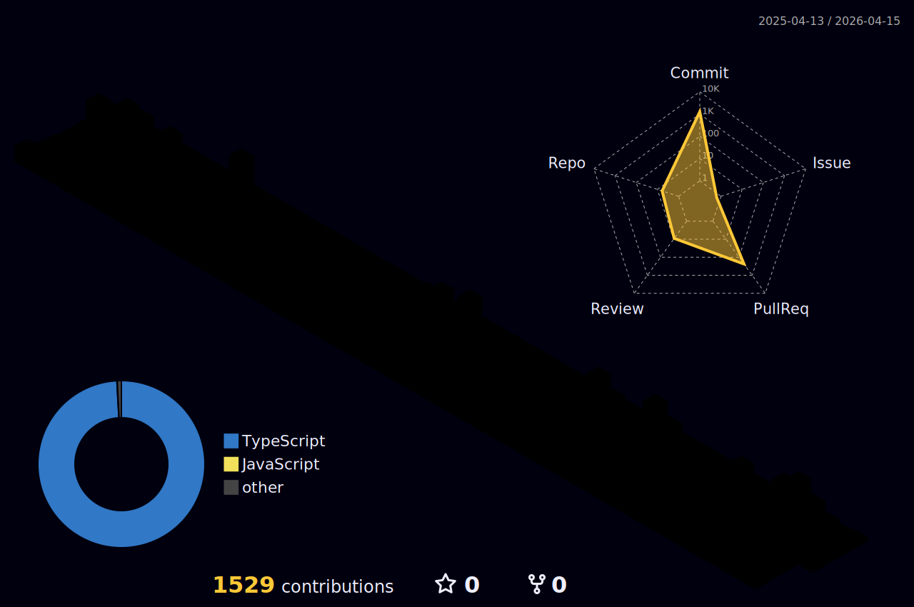

<div align="center">

<!-- Typing animation header -->


<br>

**Plataformas de Pagamento · Microsserviços · Integrações Financeiras**

<br>

[](https://www.guicardilho.com)
[](https://linkedin.com/in/guilherme-cardilho)
[](mailto:gui_cardilho@hotmail.com)

<br>


</div>

---

### 🧑‍💻 Sobre

Desenvolvedor full stack com experiência sólida no ecossistema **JavaScript/TypeScript**, atuando na construção de plataformas de pagamento escaláveis e confiáveis. Atualmente na **Fast Solutions**, trabalhando com gateway white-label que já processou **+R$264M em transações**, integrando **94+ gateways**, **132 adquirentes** e **30+ serviços BaaS**.

Formado em **Análise e Desenvolvimento de Sistemas** pela Fatec Itapetininga.

---

### 🛠 Tecnologias

<div align="center">

**Stack Principal**

[](https://skillicons.dev)

**Backend & Databases**

[](https://skillicons.dev)

**Frontend**

[](https://skillicons.dev)

**DevOps & Ferramentas**

[](https://skillicons.dev)

</div>

---

### 📊 GitHub Stats

<div align="center">


&nbsp;


<br><br>


</div>

---

### 🏆 Trophies

<div align="center">


</div>

---

### 📈 Activity

<div align="center">


</div>

---

### 🧊 3D Contributions

<div align="center">

<picture>
  <source media="(prefers-color-scheme: dark)" srcset="./profile-3d-contrib/profile-night-rainbow.svg" />
  <source media="(prefers-color-scheme: light)" srcset="./profile-3d-contrib/profile-green-animate.svg" />
  
</picture>

</div>

---

### 📋 Detalhes

<!-- README-STATS:START -->

```
🕰️ I get my jam on during the night!

🌞 Morning  	10     commits	░░░░░░░░░░░░░░░░░░░░░░░░░░░░░░	1.15%
🌆 Daytime  	146    commits	████████░░░░░░░░░░░░░░░░░░░░░░	16.82%
🌃 Evening  	173    commits	█████████░░░░░░░░░░░░░░░░░░░░░	19.93%
🌙 Night    	539    commits	██████████████████████████████	62.10%
```

```
📅 I'm most productive on Saturdays!

Monday      	80     commits	███████████░░░░░░░░░░░░░░░░░░░	9.22%
Tuesday     	123    commits	██████████████████░░░░░░░░░░░░	14.17%
Wednesday   	135    commits	████████████████████░░░░░░░░░░	15.55%
Thursday    	111    commits	████████████████░░░░░░░░░░░░░░	12.79%
Friday      	70     commits	██████████░░░░░░░░░░░░░░░░░░░░	8.06%
Saturday    	201    commits	██████████████████████████████	23.16%
Sunday      	148    commits	██████████████████████░░░░░░░░	17.05%
```

```
🧪 JavaScript for the win!

JavaScript  	11     repos	██████████████████████████████	26.19%
TypeScript  	9      repos	████████████████████████░░░░░░	21.43%
Dockerfile  	7      repos	███████████████████░░░░░░░░░░░	16.67%
HTML        	5      repos	█████████████░░░░░░░░░░░░░░░░░	11.90%
Shell       	5      repos	█████████████░░░░░░░░░░░░░░░░░	11.90%
```

<!-- README-STATS:END -->

---

<div align="center">

<picture>
  <source media="(prefers-color-scheme: dark)" srcset="https://raw.githubusercontent.com/GuiCardilho/GuiCardilho/output/github-snake-dark.svg" />
  <source media="(prefers-color-scheme: light)" srcset="https://raw.githubusercontent.com/GuiCardilho/GuiCardilho/output/github-snake.svg" />
  
</picture>

</div>
